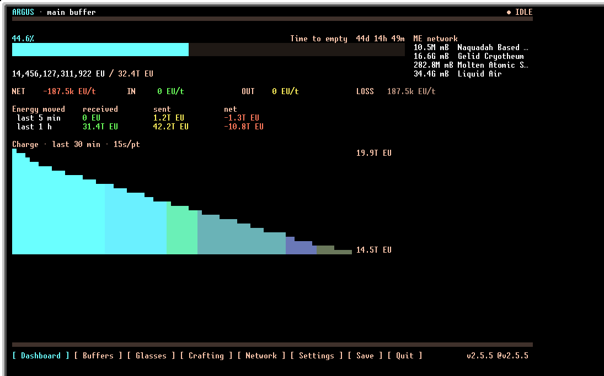
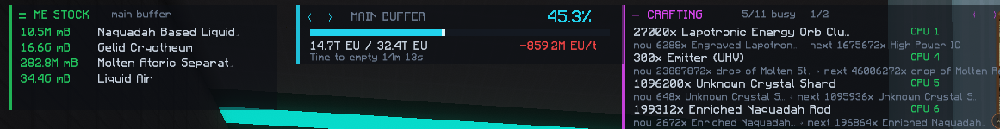
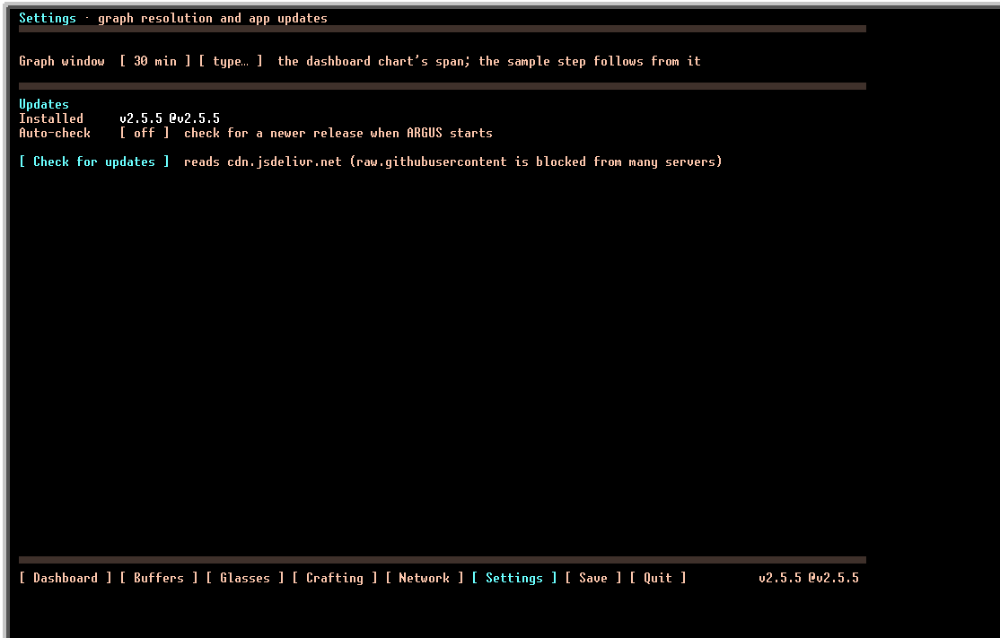
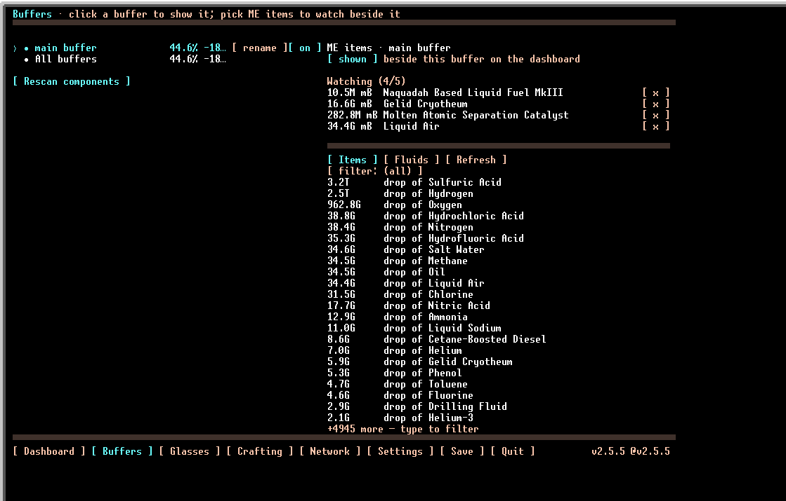
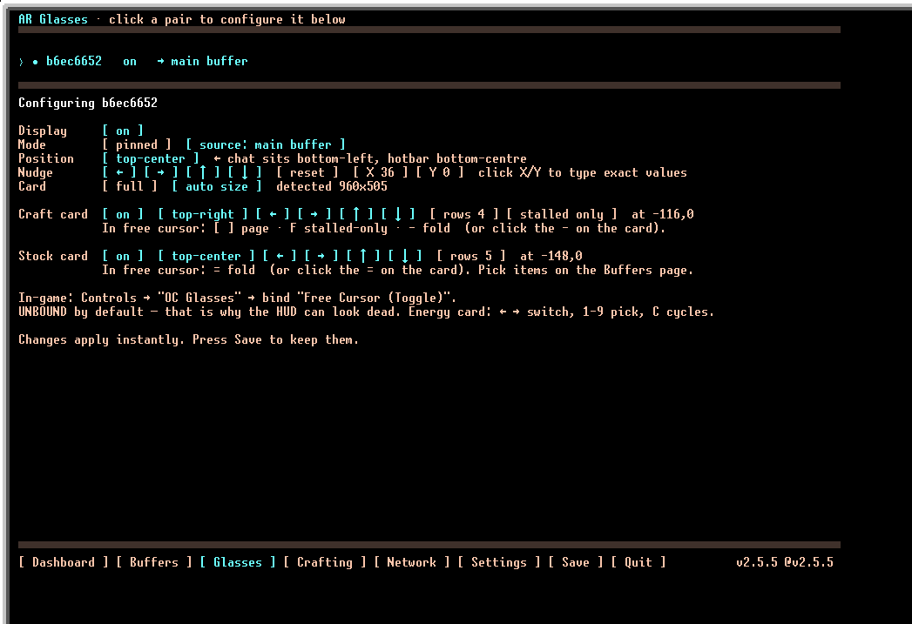
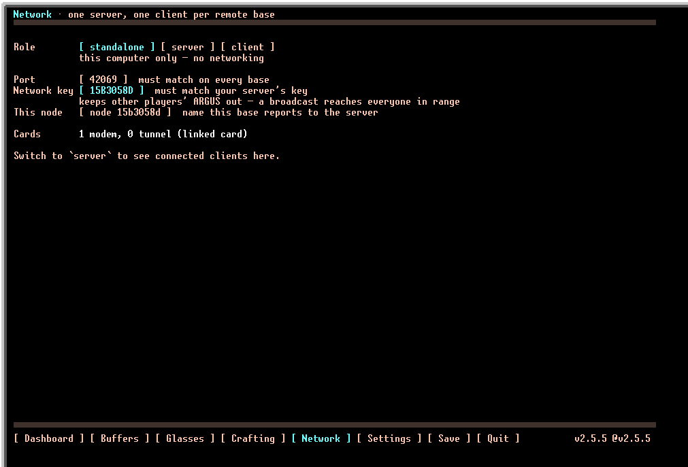
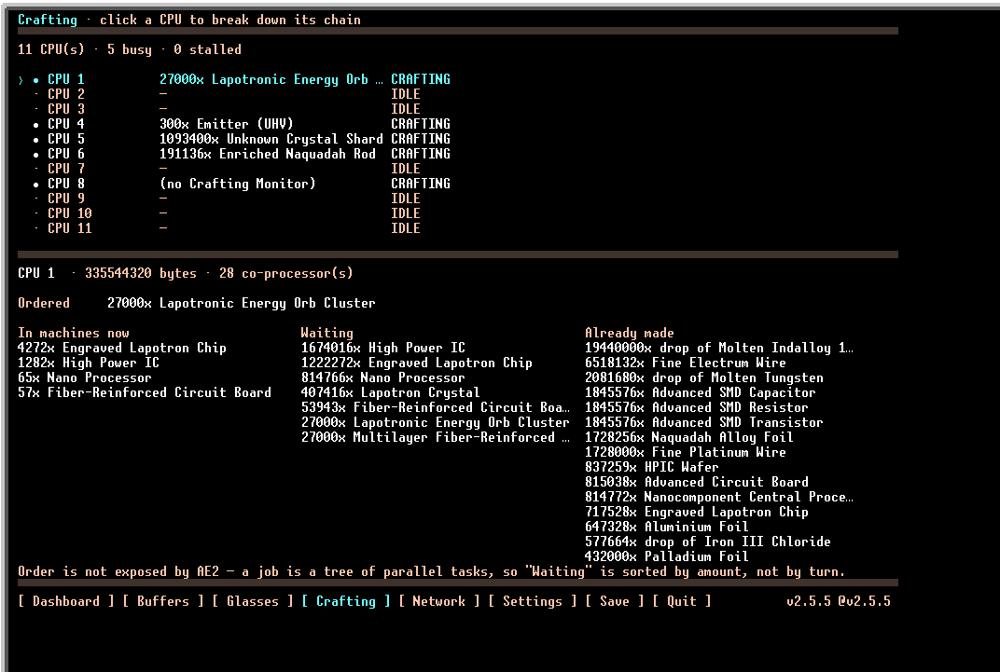

# ARGUS — мониторинг энергии для OpenComputers

[English](README.md) · **Русский**

Приложение на Lua для мода **OpenComputers** под сборку **GregTech: New Horizons 2.8.3**.
Показывает состояние энергобуферов на мониторе компьютера и в AR-очках одновременно.

Слой данных и панель энергии написаны по исходникам модов, которые реально входят в 2.8.3 —
разбирается то, что GregTech действительно отдаёт, а не то, что предполагает обычный монитор.

[История версий](CHANGELOG.ru.md) · [Технические подробности](DETAILS.ru.md) · [Лицензия и происхождение](NOTICE.ru.md)



*…и тот же буфер, очередь крафтов и ME-сток продублированы в AR-очки:*



## Возможности

- **Все типы энергобуферов**: Lapotronic Supercapacitor, Battery Buffer, беспроводная
  EU-сеть, хранилища IC2 (BatBox / CESU / MFE / MFSU / AFSU) и любой GregTech-блок с
  запасом EU (энергохатчи, трансформаторы) через универсальный адаптер.
- **Два вывода сразу**: монитор и AR-очки работают вместе и независимо. Каждый показывает
  конкретный буфер, сумму всех или циклический перебор.
- **Осмысленные метрики**: приход/расход в EU/t, **сколько энергии всего** прошло за 5 минут
  и за час (отдельно приход и расход), время до полного заряда/разряда, пассивные потери,
  статус обслуживания.
- **Точность выше наивной**: заряд LSC берётся из строк сенсора, а не из `getEUStored()`,
  который врёт выше 2⁶³; `NET` считается по изменению заряда и ловит слив в беспроводную
  сеть мимо хатчей (подробности — в разделе [«Точность и внутренности»](#точность-и-внутренности)).
- **Крафты Applied Energistics**: что заказано, что в машинах, что ждёт очереди, подсветка
  зависших заданий — на мониторе и отдельной карточкой в очках.
- **Слежение за ME-стоком**: количество выбранных предметов и жидкостей в сети, карточкой
  в очках.
- **График заряда** с окном от 30 секунд до суток; шаг точек выводится из окна (120 колонок).
- **Несколько баз**: режим сервер/клиент — удалённые базы отдают свои буферы по
  беспроводной или Linked Card, ключ сети отделяет вас от других игроков.

## Требования

**Сборка:** GTNH 2.8.3 — GT5-Unofficial `5.09.51.482`, OpenComputers `1.11.20-GTNH`,
Computronics `1.9.3-GTNH`.

| Компонент | Зачем |
|---|---|
| Computer (T2+), Screen, Keyboard | Базовая машина. Клавиатура — для ввода имён и координат. |
| GPU **T3** | Желателен: двойная буферизация, без неё интерфейс мерцает. На T2 работает, но кадр рисуется прямо на экран. |
| **Adapter** | Обязателен: приставляется к контроллеру машины. Либо MFU в адаптере — до 16 блоков. |
| Internet Card | Только для установки. |
| Terminal Glasses Bridge + Glasses | Опционально, для AR-вывода. |

## Установка

В шелле OpenOS:

```shell
cd /home
wget -f https://cdn.jsdelivr.net/gh/happyCat-dev/ARGUS@v2.5.5/setup.lua && setup
```

Установщик переберёт зеркала, скачает файлы в `/home/ARGUS` и предложит включить автозапуск.
Версия установленной сборки видна в правом нижнем углу приложения. Запуск вручную:
`cd /home/ARGUS && init`.

> **Ставьте с тега, а не с ветки.** jsDelivr кеширует `@main` по каждому файлу отдельно на
> несколько часов и может отдать файлы из разных коммитов — при этом все запросы успешны.

Не качается или обновился, но ничего не изменилось — разбор причин (TLS-обрыв, кеш `require`
в OpenOS) в [DETAILS.ru.md](DETAILS.ru.md).

Дальнейшие обновления делаются из приложения, страница **Settings**:



## Использование

Управление — мышью по экрану (ПКМ по монитору в игре). Настройки **не** сохраняются
автоматически, жмите `Save`. Выход — `Quit` или `Ctrl+C`.

| Страница | Что делает |
|---|---|
| **Dashboard** | Панель энергии выбранного источника. |
| **Buffers** | Клик — показать буфер. `rename` — своё имя. `on/off` — опрос. `Rescan components` — перечитать компоненты. |
| **Glasses** | Настройки AR-панели для очков: источник, положение, размер, карточки крафтов и стока. |
| **Crafting** | Крафты ME-сети: CPU, цепочка выбранного, зависшие задания. |
| **Network** | Режим сервер/клиент, ключ сети, порт, список подключённых баз. |
| **Settings** | Окно графика (от 30 сек до суток, пресетом или числом) и обновления: авто-проверка и «Check for updates». |
| **Save** | Сохраняет настройки в `/home/ARGUS/settings/config`. |

**Состояния буфера:** `ONLINE` — энергия течёт · `IDLE` — доступен, но не движется ·
`OFF` — работа отключена · `PROBLEM` — нужно обслуживание · `MISSING` — компонент недоступен.

На **Buffers** также выбираются предметы и жидкости ME-сети, которые показывать рядом с буфером:



Из очков источник переключается без подхода к компьютеру: `←`/`→` — сосед, `1`…`9` — по
номеру, `C` — цикл. Требует назначенной клавиши Free Cursor в `Настройки → Управление →
OC Glasses` (по умолчанию она **не назначена** — иначе кажется, что приложение сломано).
Страница **Glasses** настраивает каждую пару — источник, положение, размер, карточки крафтов
и стока:



## Несколько баз: сервер и клиенты

Сети OpenComputers **не объединяются** — компонент виден только внутри своего `Network`, а
беспроводные и Linked карты переносят только сообщения. Поэтому на каждой удалённой базе
стоит свой ARGUS в режиме `client`: он читает свои буферы локально и шлёт **готовые числа**
серверу, тот показывает их наравне со своими, в том числе в агрегате.

- **Wireless Network Card (T2)** — одно измерение, до ~400 блоков.
- **Linked Card** — другое измерение или без лимита дальности, строго 1:1.
- **Ключ сети** отделяет ваши базы от чужих на общем сервере (`modem.broadcast` слышит любой
  модем на том же порту). Это SSID, а не пароль — для приватности нужна Linked Card.

Настройка на странице **Network** обеих баз: роль, общий ключ, общий порт, имя базы.
Полный разбор транспортов и защиты — в [DETAILS.ru.md](DETAILS.ru.md).



## Крафты и сток Applied Energistics

Страница **Crafting** и карточки в очках показывают, что автокрафт делает сейчас, и
подсвечивают зависшие задания (два порога простоя). Слежение за стоком выводит количество
выбранных предметов и жидкостей.

Нужен **Adapter** к **ME Controller** и **Crafting Monitor** в сборке каждого CPU (иначе
не виден итоговый предмет). Работает **только на GTNH-сборке** OpenComputers — апстрим про
запущенный крафт не сообщает ничего ([issue #3786](https://github.com/MightyPirates/OpenComputers/issues/3786)).
Если страница пуста, причину покажет `tools/medump.lua`.



## Точность и внутренности

Слой данных построен по исходникам GT5-Unofficial `5.09.51.482` и Computronics `1.9.3-GTNH`.

- **Парсинг по лейблам, а не по индексам** — аддон вставляет строку сенсора, и индексный
  разбор даёт молча неверные числа; ARGUS ищет по лейблу и возвращает `nil`, если строки нет.
- **Точность LSC** — `getEUStored()` обрезает BigInteger на `longValue()` и врёт выше 2⁶³
  (в 2.8.3 не починено). ARGUS хранит заряд точной десятичной строкой из сенсора и печатает её.
- **Скорость по изменению заряда**, а не «IN минус OUT» — работает даже для IC2 без счётчиков
  прохода и учитывает пассивные потери.
- **Ширина строк в символах, а не в байтах** — `gpu.set` двигается по символам, поэтому
  не-ASCII (`●`, `…`) не смещает вёрстку.
- **Работает на GPU T2** — кадр рисуется напрямую, без буферов видеопамяти; T3 желателен,
  но не обязателен.

## Разработка

Вся логика ниже рендереров — чистый Lua и тестируется вне Minecraft:

```shell
lua tests/run.lua        # проверки: парсинг сенсоров, метрики, крафты, сток, форматирование
lua tests/preview.lua [dashboard|buffers|glasses|crafting|network|stock]   # UI в текст
```

```
init.lua              точка входа и главный цикл
setup.lua             установщик
config/               загрузка и сохранение настроек
core/
  sensor.lua          разбор getSensorInformation() по лейблам
  sources/            адаптеры буферов (lsc, batterybuffer, ic2, energycontainer)
  monitor.lua         опрос, агрегация, виртуальные wireless-представления
  craft.lua           опрос CPU ME-сети, вывод цепочки и остановок
  stock.lua           слежение за количеством предметов и жидкостей в ME-сети
  metrics.lua         скорости, средние, прогноз времени
  states.lua          статусы буфера (ONLINE / IDLE / OFF / …)
  ring.lua            кольцевой буфер истории
  update.lua          проверка и установка новой версии через jsDelivr → setup.lua
lib/graphics/         ar.lua (очки), graphics.lua (GPU), colors.lua
lib/utils/            parser, screen, text, time
ui/                   экранный интерфейс: panel, graph, widgets, app, format
ar/                   AR-интерфейс: panel (энергия), craft, stock, менеджер очков
net/                  распределённый режим: транспорт, сервер, клиент
tools/sensordump.lua  диагностика энергокомпонентов
tools/medump.lua      диагностика ME-сети
```

Новый тип буфера: модуль в `core/sources/` с полями `kind`, `label`, `componentTypes`,
функциями `detect(proxy, lines, componentType)` (уверенность, 0 — «не моё») и
`read(proxy, lines)`; зарегистрировать в `adapters` в `core/sources/init.lua`.

## Лицензия

**GPL-3.0**. Полные условия и происхождение — в [LICENSE.md](LICENSE.md) и [NOTICE.ru.md](NOTICE.ru.md).
